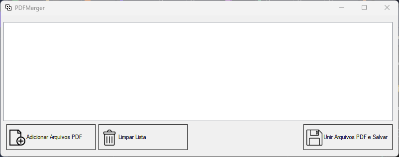

# PDF Merger - Aplicativo Desktop em C# com Windows Forms

Este projeto é um aplicativo desktop desenvolvido em **C# com .NET (Windows Forms)** utilizando a biblioteca **PDFsharp**. Ele permite **unir múltiplos arquivos PDF** em um único documento, de forma simples e intuitiva.

## 🧰 Tecnologias Utilizadas

- [.NET Framework](https://dotnet.microsoft.com/)
- [Windows Forms](https://learn.microsoft.com/dotnet/desktop/winforms/)
- [PDFsharp](http://pdfsharp.net/)

## 📋 Funcionalidades

- **Adicionar Arquivos PDF**: Abre uma janela de diálogo para selecionar um ou mais arquivos PDF. Os nomes dos arquivos são exibidos em um `ListBox`.
- **Excluir Arquivo da Lista**: Ao clicar em um item do `ListBox`, é exibida a opção de excluir aquele arquivo da lista.
- **Limpar Lista**: Remove todos os arquivos da lista.
- **Unir Arquivos PDF e Salvar**: Une os PDFs selecionados na ordem em que aparecem na lista e permite salvar o resultado em um novo arquivo PDF.

## 🎮 Como Usar

1. **Execute o aplicativo.**
2. Clique em **"Adicionar Arquivos PDF"** para selecionar os arquivos que deseja unir.
3. Os arquivos selecionados serão exibidos na lista.
4. (Opcional) Clique em um arquivo da lista para removê-lo individualmente.
5. (Opcional) Clique em **"Limpar Lista"** para remover todos os arquivos.
6. Clique em **"Unir Arquivos PDF e Salvar"**, escolha o local de destino e o nome do novo arquivo PDF.

## 💡 Observações

- Os arquivos serão unidos na ordem em que foram adicionados à lista.
- Apenas arquivos com extensão `.pdf` são suportados.
- O aplicativo é voltado para uso em **ambiente Windows**.

## 📷 Interface



## 📦 Como Executar/Compilar

1. Clone este repositório:
   ```bash
   git clone https://github.com/adrianoacarvalho/PDFMerger.git
   ```
2. Abra o projeto no **Visual Studio**.
3. Certifique-se de que a referência à biblioteca **PDFsharp** esteja instalada via NuGet:
   ```powershell
   Install-Package PDFsharp
   ```
4. Compile e execute a aplicação.

